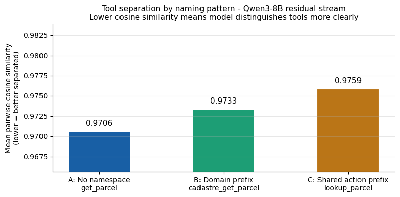
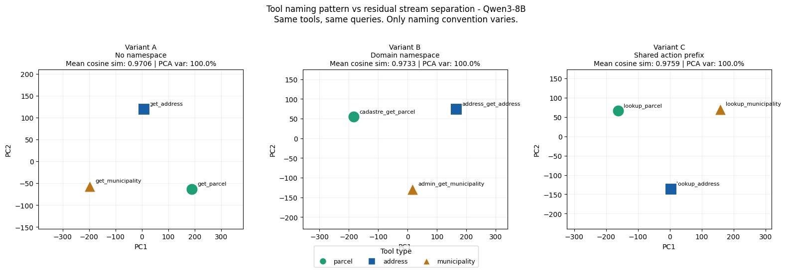

# Tool Design and Residual Stream Geometry

Small preliminary experiment investigating whether tool naming conventions affect
internal tool separation in Qwen3-8B's residual stream. Not statistically significant.

---

## Research Question

Does tool naming pattern affect how a language model internally separates
tool identities, independent of tool functionality and user queries?

---

## Method

Three geospatial tools (cadastral lookup, address lookup, municipality lookup)
are defined in three naming variants. Tools and queries are identical across
variants. Only the naming convention changes.

| Variant | Pattern | Example |
|---------|---------|---------|
| A | No namespace | get_parcel |
| B | Domain prefix | cadastre_get_parcel |
| C | Shared action prefix | lookup_parcel |

Residual stream activations are extracted at the last token position in the
penultimate layer (layer 35 of 36) for 3 queries per tool. Mean activation
vectors are computed per tool and compared using pairwise cosine similarity.

Lower cosine similarity means more distinct internal representations.

Model: Qwen3-8B

Layer: Penultimate, following Wu et al. 2026

Queries per tool: 3

---

## Results

### Mean pairwise cosine similarity by variant

| Variant | Pattern | Mean cosine sim |
|---------|---------|----------------|
| A | No namespace | 0.9706 |
| B | Domain prefix | 0.9733 |
| C | Shared action prefix | 0.9759 |

Delta between best and worst: 0.0052

### Pairwise cosine similarity

| Variant | Tool pair | Cosine sim |
|---------|-----------|-----------|
| A | get_parcel vs get_address | 0.9801 |
| A | get_parcel vs get_municipality | 0.9545 |
| A | get_address vs get_municipality | 0.9772 |
| B | cadastre_get_parcel vs address_get_address | 0.9626 |
| B | cadastre_get_parcel vs admin_get_municipality | 0.9766 |
| B | address_get_address vs admin_get_municipality | 0.9808 |
| C | lookup_parcel vs lookup_address | 0.9794 |
| C | lookup_parcel vs lookup_municipality | 0.9687 |
| C | lookup_address vs lookup_municipality | 0.9795 |

### PCA of residual stream activations

Each point is a tool's mean activation vector projected to 2D. PCA variance
is 100% across all variants as expected with 3 points in 4096 dimensions.

---

## Discussion

Variant A achieves the best separation. Variant C, where all tool names
share the lookup_ prefix, achieves the worst. The shared prefix reduces
internal separation before the model processes the semantic content of
the name, consistent with Wu et al. 2026 who found that tools sharing a
tokenizer prefix are harder to distinguish internally.

Effect sizes are small but directionally consistent. Wu et al. showed that
cosine differences in this range predict meaningful accuracy differences at
scale. This experiment is indicative rather than conclusive given 3 tools
and 3 queries per tool.

## Reference

Wu et al. 2026. Tool Calling is Linearly Readable and Steerable in
Language Models. arXiv:2605.07990v1.